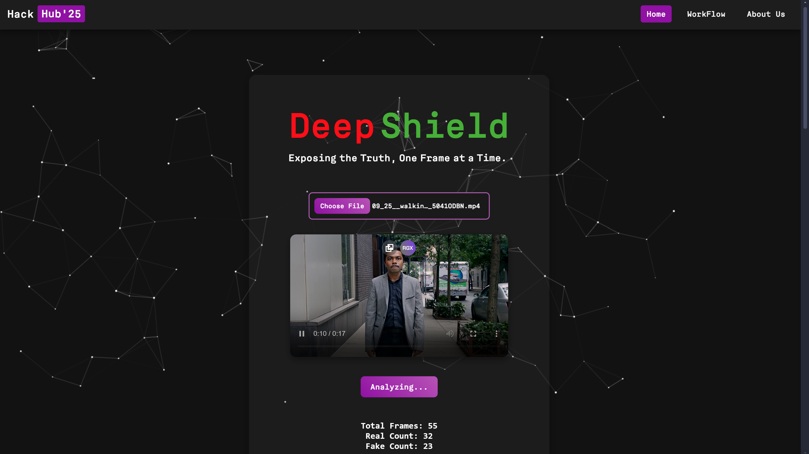

<body>

<h1>Deepfake Video Detection with Vision Transformer (ViT)</h1>

This project detects deepfake videos using a Vision Transformer (ViT) model, classifying frames as real or manipulated with high accuracy.

<h2>Table of Contents</h2>
<ul>
    <li>Dataset Preparation</li>
    <li>Model Architecture</li>
    <li>Training Process</li>
    <li>Validation and Metrics</li>
    <li>Video Prediction</li>
    <li>Installation and Setup</li>
    <li>Results</li>
    <li>Website Usage</li>
</ul>

<h2>Dataset Preparation</h2>
<h3>Video Directories:</h3>
<ul>
    <li><strong>Real Videos:</strong> <code>/DFD_original_sequences</code></li>
    <li><strong>Manipulated Videos:</strong> <code>/DFD_manipulated_sequences</code></li>
</ul>

<h3>Frame Extraction:</h3>

Extract frames at 1 frame per second for model input.

<h2>Model Architecture</h2>

<ul>
    <li><strong>Base Model:</strong> ViT (<code>vit_base_patch16_224</code>)</li>
    <li><strong>Input Size:</strong> 224x224 pixels</li>
    <li><strong>Classes:</strong> 2 (Real, Manipulated)</li>
    <li><strong>Pretrained Weights:</strong> Yes (ImageNet)</li>
</ul>

<h3>Model Initialization:</h3>
<pre><code>model = timm.create_model('vit_base_patch16_224', pretrained=True, num_classes=2)
model.to(device)
model = nn.DataParallel(model)</code></pre>

<h2>Training Process</h2>
<h3>Transformations:</h3>
<pre><code>transform = transforms.Compose([
    transforms.Resize((224, 224)),
    transforms.RandomHorizontalFlip(),
    transforms.ColorJitter(brightness=0.2),
    transforms.ToTensor(),
    transforms.Normalize(mean=[0.485, 0.456, 0.406], std=[0.229, 0.224, 0.225])
])</code></pre>

<h3>Training Loop:</h3>
<pre><code>for epoch in range(num_epochs):
    model.train()
    for images, labels in train_loader:
        images, labels = images.to(device), labels.to(device)
        optimizer.zero_grad()
        outputs = model(images)
        loss = criterion(outputs, labels)
        loss.backward()
        optimizer.step()</code></pre>

<h2>Validation and Metrics</h2>
<h3>Classification Report:</h3>
<pre><code>print(classification_report(all_labels, all_predictions, target_names=['Real', 'Manipulated']))</code></pre>

<h3>Confusion Matrix:</h3>
<pre><code>sns.heatmap(cm, annot=True, cmap='Blues')
plt.xlabel('Predicted')
plt.ylabel('Actual')
plt.show()</code></pre>

<h2>Video Prediction</h2>
<pre><code>def predict_video(video_path, model, transform, device):
    cap = cv2.VideoCapture(video_path)
    real_count, manipulated_count = 0, 0
    while cap.isOpened():
        ret, frame = cap.read()
        if not ret:
            break
        image = transform(Image.fromarray(cv2.cvtColor(frame, cv2.COLOR_BGR2RGB))).unsqueeze(0).to(device)
        with torch.no_grad():
            outputs = model(image)
            _, predicted = torch.max(outputs, 1)
        real_count += (predicted.item() == 0)
        manipulated_count += (predicted.item() == 1)
    cap.release()</code></pre>

<h2>Installation and Setup</h2>
<h3>Install Packages:</h3>
<pre><code>pip install timm torch torchvision opencv-python pillow scikit-learn seaborn matplotlib</code></pre>

<h3>CUDA Verification:</h3>
<pre><code>print("CUDA Available:", torch.cuda.is_available())
print("GPU Name:", torch.cuda.get_device_name(0) if torch.cuda.is_available() else "No GPU")</code></pre>

<h2>Results</h2>
<ul>
    <li>Training Accuracy: ~89.71%</li>
    <li>Validation Accuracy: ~87.77%</li>
</ul>

<h2>Website Usage</h2>

<h2>Contributors</h2>

    

        <h3>Yadeesh T</h3>
        
Email: <a href="mailto:yadeesh005@gmail.com">yadeesh005@gmail.com</a>

        
LinkedIn: <a href="https://www.linkedin.com/in/yadeesh-t-259640288" target="_blank">Profile</a>

    

    

        <h3>Gokul Ram K</h3>
        
Email: <a href="mailto:gokul.ram.kannan210905@gmail.com">gokul.ram.kannan210905@gmail.com</a>

        
LinkedIn: <a href="https://www.linkedin.com/in/gokul-ram-k-277a6a308" target="_blank">Profile</a>

    

    

        <h3>Rohit N</h3>
        
Email: <a href="mailto:rohit84.official@gmail.com">rohit84.official@gmail.com</a>

        
LinkedIn: <a href="https://www.linkedin.com/in/rohit-n-1b0984280" target="_blank">Profile</a>

    

    

        <h3>Rahul B</h3>
        
Email: <a href="mailto:rahulbalachandar24@gmail.com">rahulbalachandar24@gmail.com</a>

        
LinkedIn: <a href="https://www.linkedin.com/in/rahul-balachandar-a9436a293" target="_blank">Profile</a>

    

</body>
</html>
